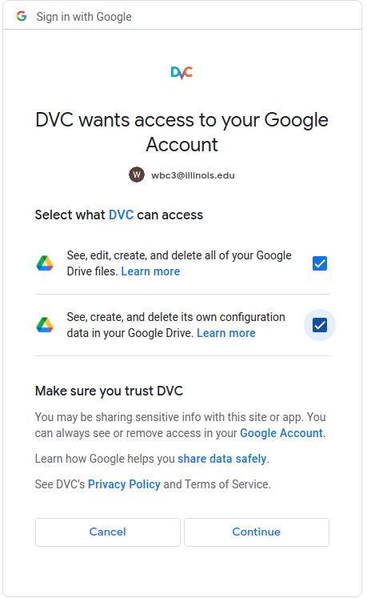

## [Install DVC](https://dvc.org/doc/install)

    pip install dvc 'dvc[gdrive]'
    dvc config --global core.analytics false

## Contributors will need to pull the dvc data

    dvc pull

## After a git chekcout or pull that impacts data

    dvc checkout

## Files

    .dvc/config
    dvc.yaml
    dvc.lock
    parameters.yaml

## Notes

### [Data and Model Access](https://dvc.org/doc/start/data-and-model-access)

`dvc get` is useful for fetching files outise of a dvc project environment.

`dvc import` is useful for fetching a dvc managed data while also creating a local `.dvc` file that can be saved in the project.

`dvc update` is used to fetch current versions of data.

### [Data Pipelines](https://dvc.org/doc/start/data-pipelines)

[`dvc run`](https://dvc.org/doc/command-reference/run) is used to create _stages_.  Stages are source code tracked by git which form the steps in a _pipeline_.  Stages also connect code to it's corresponding data _input_ and _output_.

By specifying lists of dependencies and/or outputs, we create a DAG that connects them.

See [`dvc dag`](https://dvc.org/doc/command-reference/dag) for visualization of the DAG.

Stage configurations are stored in yaml [Pipeline Files](https://dvc.org/doc/user-guide/project-structure/pipelines-files)

[`dvc.yaml` schema](https://github.com/iterative/dvcyaml-schema)

`dvc repro`: Reproduce results from pipeline.

### [Metrics, Parameters, and Plots](https://dvc.org/doc/start/metrics-parameters-plots)

Metrics, Parameters and Plots can all be combined into Experiments to run and compare iterations.

Stage Parameters can be shared from config files.  By default parameters are ready from `params.yaml`.  

`dvc repro` will only run the stages necessary given any changes.  It's use the cache were possible. 

`dvc params diff` can show how params in the current workspace differ from the last commit.

`dvc metrics diff` does the same for metrics.

`dvc plots diff` will compare plots.

### [Experiments](https://dvc.org/doc/start/experiments)

Experiment:  An attempt to reach desired/better/interesting results during data pipelining or ML model development. DVC is designed to help manage experiments, having built-in mechanisms like the run-cache and the dvc experiments commands 

`dvc exp run...` is an easy way to change hyperparameters and run new experiments.

`dvc exp diff` compares experiment results.

`dvc exp run --queue...` allows you to queue up experiment runs for altering hyperparameters.  `dvc exp run --run-all --jobs 2` will run all experiments in parallel.

`dvc exp show...`  compares any number of experiments in one table.

You can name an experiment with `dvc exp run -n`.

`dvc exp apply` is used to apply chosen exp parameters to files prior to commiting to git.

Experiments that have not been made persistent will not be stored or shared remotely through dvc push or git push.

use `-n` to show experiments from the previous n commits:

`dvc exp gc --workspace` will flush all references to old (not persisted) experiments.  This will only remove the references, not the cached results.  Use `dvc gc` to clean up the cache.

[Experiment Management; Project organization](https://dvc.org/doc/user-guide/experiment-management#organization-patterns)

## Other Refrences

[Versioning Data and Models](https://dvc.org/doc/use-cases/versioning-data-and-model-files)

[Data Registries](https://dvc.org/doc/use-cases/data-registries)

[Data and Model Versioning - Tutorial](https://dvc.org/doc/use-cases/versioning-data-and-model-files/tutorial)

[Experiment Checkpoints in Source Code](https://dvc.org/doc/user-guide/experiment-management#checkpoints-in-source-code)

[R Package for DVC](https://rdrr.io/github/andrewcstewart/dvc-r/api/)

[GDrive Configuration](https://dvc.org/doc/user-guide/setup-google-drive-remote#url-format)

[Dagshub](https://dagshub.com/?utm_source=google&utm_medium=cpc&utm_campaign=search-data-science-github&utm_id=13291698713&gclid=CjwKCAjwi9-HBhACEiwAPzUhHIIv_SSd30EWaP0rEXboIEYTBMrndXCd_OnaosaYOBMmx7idAD7J6RoCBn4QAvD_BwE)

[Versioning large data sets with S3](https://dvc.org/doc/user-guide/managing-external-data)

decompress: https://dvc.org/doc/command-reference/run

## Original Initialization of dvc in the current git project repository.

    dvc config --global core.analytics false
    dvc init
    dvc add Data
    dvc remote add -d msfe_ie522_summer_project_data	gdrive://1zvK5a6L978aK1TPVHUOnGIYmAO6a53Yg
    dvc push
    
DVC will then give you a URL to visit to provide access to the Google Drive.  Configure accordingly.

